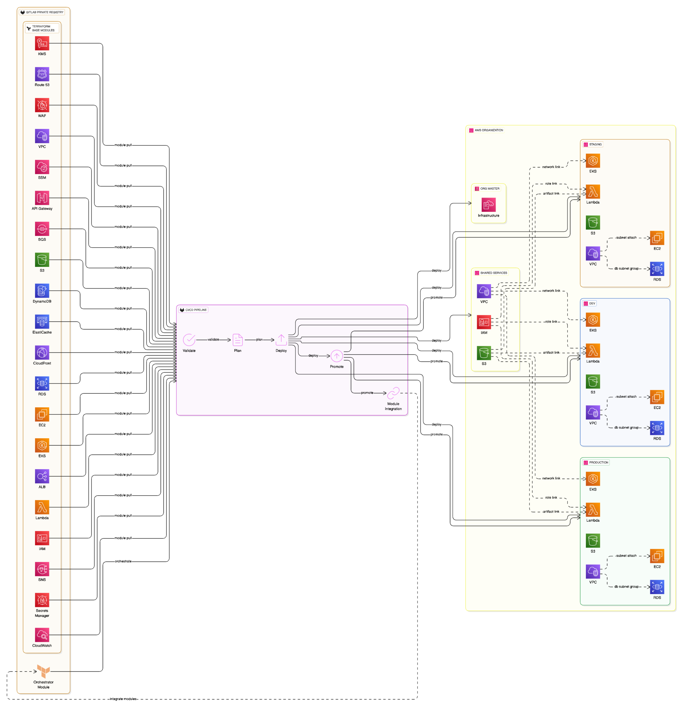

# Terraform Orchestration and Automation Framework

[](https://gitlab.com/your-org/terraform-orchestration-framework/-/pipelines)
[](https://www.terraform.io/)
[](https://registry.terraform.io/providers/hashicorp/aws/latest)

> **Enterprise Terraform orchestration framework for platform engineering teams - supports ANY AWS service base modules with automated branch-based promotion workflow**

## Architecture Overview

This solution implements the **Terraform Orchestration and Automation Framework** - designed for platform engineering teams to orchestrate ANY AWS service base modules with automated promotion workflows.

## AWS Architecture Pattern Guide (APG)

**This implementation is part of the official [AWS Architecture Pattern Guide (APG)](https://apg-library.amazonaws.com/content-viewer/4cf1a61e-2f34-459c-98f1-b5400c918a8e)** - providing enterprise-grade Terraform orchestration patterns for multi-account AWS environments.

**APG Pattern Benefits**:
- **AWS-validated architecture** following enterprise best practices
- **Multi-account strategy** aligned with AWS Well-Architected Framework
- **Security-first design** with cross-account role assumptions
- **Production-ready** with comprehensive documentation and examples
- **Scalable pattern** supporting any AWS service modules
- **Cost optimization** through centralized state management and resource sharing
- **Compliance ready** with built-in governance and audit capabilities
- **Enterprise adoption** proven in large-scale AWS environments

> **Important Note**: This repository uses **ALB and EC2 modules as demonstration examples** to show the orchestrator pattern. The same approach works for ANY AWS service base modules (VPC, RDS, Lambda, S3, Route53, EKS, etc.) created by your platform engineering team.

### Key Features

- **Universal Support**: Works with ANY AWS service modules (VPC, RDS, Lambda, S3, Route53, EKS, etc.)
- **Automated Promotion**: Dev → Staging → Production with branch-based workflows
- **Multi-Account Support**: Secure cross-account deployments using AWS Organizations
- **Security First**: Role-based access with least privilege principles
- **Platform Engineering Ready**: Integrates with any base modules created by platform teams
- **GitOps Ready**: Complete CI/CD integration with GitLab
- **State Management**: Centralized state with locking and encryption

### Architecture Diagram



**Multi-Account Architecture Overview**:
- **AWS Organization** with centralized billing and management
- **Shared Services Account** for Terraform state and locking
- **Environment-specific accounts** (Dev, Staging, Production)
- **Cross-account role assumption** for secure deployments
- **Universal module support** for any AWS service

### Universal Module Support

**Supported AWS Services** (via Platform Engineering Base Modules):
- **Networking**: VPC, Subnets, Route Tables, NAT Gateways, Transit Gateway
- **Compute**: EC2, Auto Scaling Groups, EKS, ECS, Lambda, Batch
- **Storage**: S3, EBS, EFS, FSx, Storage Gateway
- **Database**: RDS, DynamoDB, ElastiCache, DocumentDB, Neptune
- **Load Balancing**: ALB, NLB, CloudFront, Route53, API Gateway
- **Security**: IAM, Secrets Manager, KMS, Certificate Manager
- **Monitoring**: CloudWatch, X-Ray, Config, CloudTrail
- **DevOps**: CodePipeline, CodeBuild, CodeDeploy, Systems Manager

**Demonstration Example** (ALB + EC2):
This repository includes ALB and EC2 base modules as **working examples** to demonstrate the framework pattern. The exact same approach works for ANY AWS service base modules:
- Replace `alb_spec` with `rds_spec`, `lambda_spec`, `vpc_spec`, etc.
- Use your platform engineering team's base modules
- Follow the same promotion workflow for any AWS service

## Quick Start

### Prerequisites

1. **AWS Organization** with cross-account roles configured
2. **GitLab** with CI/CD enabled
3. **Terraform** >= 1.6
4. **AWS CLI** configured with appropriate permissions

## Replace Placeholder Values

**CRITICAL**: Before deployment, you MUST replace all placeholder values with your actual AWS account information. Deploying with placeholders will cause authentication failures.

### Required Replacements

1. **Update AWS Account Configuration**:
   ```bash
   # Edit config/aws-accounts.json
   vim config/aws-accounts.json
   ```
   Replace these placeholders:
   - `SHARED_SERVICES_ACCOUNT_ID` → Your actual shared services account ID
   - `ORG_MASTER_ACCOUNT_ID` → Your organization master account ID
   - `DEV_ACCOUNT_ID` → Your development account ID
   - `STAGING_ACCOUNT_ID` → Your staging account ID
   - `PRODUCTION_ACCOUNT_ID` → Your production account ID

2. **Update Terraform Variables**:
   ```bash
   # Edit each environment's tfvars file
   vim tfvars/dev-terraform.tfvars
   vim tfvars/stg-terraform.tfvars
   vim tfvars/prod-terraform.tfvars
   ```
   Replace these placeholders:
   - `SHARED_SERVICES_ACCOUNT_ID` → Your shared services account ID
   - `ORG_MASTER_ACCOUNT_ID` → Your organization master account ID
   - `DEV_ACCOUNT_ID` / `STAGING_ACCOUNT_ID` / `PRODUCTION_ACCOUNT_ID` → Respective account IDs

3. **Update GitLab CI/CD Variables**:
   In GitLab Project Settings → CI/CD → Variables, set:
   - `TERRAFORM_STATE_BUCKET` → Your actual S3 bucket name
   - `TERRAFORM_LOCKS_TABLE` → Your actual DynamoDB table name

4. **Verify Configuration**:
   ```bash
   # Run validation script to check for remaining placeholders
   ./scripts/validate-configuration.sh
   ```

**WARNING**: Failure to replace placeholders will result in:
- Authentication failures during deployment
- Pipeline failures with "Access Denied" errors
- Inability to assume cross-account roles

See [REFERENCE-VALUES.md](REFERENCE-VALUES.md) for complete placeholder reference.

### 5-Minute Setup

1. **Clone and configure**:
   ```bash
   git clone https://gitlab.com/{YOUR_ORG}/smart-terraform-orchestrator.git
   cd smart-terraform-orchestrator
   
   # Copy configuration templates
   cp config/aws-accounts.json.example config/aws-accounts.json
   cp tfvars/dev-terraform.tfvars.example tfvars/dev-terraform.tfvars
   cp tfvars/stg-terraform.tfvars.example tfvars/stg-terraform.tfvars
   cp tfvars/prod-terraform.tfvars.example tfvars/prod-terraform.tfvars
   ```

2. **Update configuration files** with your values:
   ```bash
   # Edit with your AWS account IDs and settings
   vim config/aws-accounts.json
   vim tfvars/dev-terraform.tfvars
   # See REFERENCE-VALUES.md for complete placeholder reference
   ```

3. **Configure GitLab CI/CD variables** in Project Settings → CI/CD → Variables:
   ```
   AWS_ACCESS_KEY_ID (protected, masked)
   AWS_SECRET_ACCESS_KEY (protected, masked)
   GITLAB_API_TOKEN (protected, masked)
   TERRAFORM_STATE_BUCKET
   TERRAFORM_LOCKS_TABLE
   ```

4. **Validate configuration**:
   ```bash
   chmod +x scripts/validate-configuration.sh
   ./scripts/validate-configuration.sh
   ```

5. **Deploy to dev**:
   ```bash
   git checkout dev
   git add .
   git commit -m "feat: initial infrastructure setup"
   git push origin dev
   # Automatically deploys to dev environment
   ```

## **Important: This is an Orchestration Framework**

**What you see in this repository**:
- ALB and EC2 modules are **demonstration examples only**
- Shows the orchestrator pattern with working AWS services
- Provides a complete, testable implementation

**What you can do with this framework**:
- **Replace ALB/EC2** with ANY AWS service base modules
- **Use your platform engineering team's modules** for VPC, RDS, Lambda, S3, etc.
- **Follow the exact same workflow** for any AWS service
- **Scale to hundreds of modules** across all AWS services

**To adapt for your services**:
1. Replace `alb_spec` and `ec2_spec` with your service specifications (e.g., `rds_spec`, `lambda_spec`)
2. Update `base_modules` configuration with your platform team's repositories
3. Use the same branch-based promotion workflow for any infrastructure

## Deployment Workflow

### Branch-Based Promotion Strategy

This orchestrator implements a **strict branch-based promotion workflow**:

```
Developer commits to dev branch
         ↓
Automatic validation & planning
         ↓
Automatic deployment to DEV
         ↓
Success → Auto-create MR: dev → staging
         ↓
Manual review & merge MR
         ↓
Plan & manual approval for STAGING
         ↓
Deploy to STAGING
         ↓
Success → Auto-create MR: staging → production
         ↓
Manual review & merge MR
         ↓
Plan & manual approval for PRODUCTION
         ↓
Deploy to PRODUCTION
```

### Environment Rules

| Environment | Branch | Deployment | Approval | Auto-Promotion |
|-------------|--------|------------|----------|----------------|
| Development | `dev` | Automatic | None | Yes - To staging |
| Staging | `staging` | Manual | Required | Yes - To production |
| Production | `production` | Manual | Required | No - End of chain |

## Step-by-Step Deployment Guide

### 1. Development Deployment

```bash
# Work only in dev branch
git checkout dev

# Make your infrastructure changes
vim tfvars/dev-terraform.tfvars
vim main.tf
vim variables.tf
vim outputs.tf

# Commit and push
git add .
git commit -m "feat: add new ALB configuration for microservices"
git push origin dev
```

**What happens automatically**:
- Pipeline validates Terraform configuration
- Sets up backend in shared services account
- Plans infrastructure for dev environment
- **Automatically deploys** to dev environment
- Creates MR from `dev` → `staging`

### 2. Staging Promotion

```bash
# Review the auto-created MR in GitLab UI
# Merge the MR: dev → staging
```

**What happens**:
- Pipeline triggers on staging branch
- Plans infrastructure for staging environment
- **Manual approval required** in GitLab CI/CD
- Deploys to staging environment
- Creates MR from `staging` → `production`

### 3. Production Promotion

```bash
# Review the auto-created MR in GitLab UI
# Merge the MR: staging → production
```

**What happens**:
- Pipeline triggers on production branch
- Plans infrastructure for production environment
- **Manual approval required** in GitLab CI/CD
- Deploys to production environment

## Infrastructure Destruction

### Destroy Specific Environment

1. **Go to GitLab CI/CD → Pipelines**
2. **Click "Run Pipeline"**
3. **Select target branch** (dev/staging/production)
4. **Add pipeline variable**:
   - Variable: `DESTROY_ENVIRONMENT`
   - Value: `dev` | `staging` | `production`
5. **Run the pipeline**
6. **Manually approve** the destroy job

### Destroy Commands

```bash
# Destroy dev environment
# Set DESTROY_ENVIRONMENT=dev in GitLab pipeline variables

# Destroy staging environment  
# Set DESTROY_ENVIRONMENT=staging in GitLab pipeline variables

# Destroy production environment
# Set DESTROY_ENVIRONMENT=production in GitLab pipeline variables
```

**Destroy Process**:
1. **validate** → **destroy:environment** (manual approval required)
2. All resources are permanently deleted
3. Terraform state is updated

## Configuration Reference

### Universal Configuration Pattern

Configure ANY AWS service modules in your `tfvars/*.tfvars` files:

```hcl
# Project Configuration
project_name = "your-project-name"
gitlab_host  = "gitlab.your-company.com"
gitlab_org   = "your-gitlab-org"

# AWS Configuration
account_id              = "123456789012"
org_master_account_id   = "123456789012"
aws_region              = "us-east-1"
environment             = "dev|staging|production"

# Base Modules Configuration (Platform Engineering)
base_modules = {
  vpc = {
    repository = "vpc-base-module"
    version    = "v1.0.0"
  }
  rds = {
    repository = "rds-base-module"
    version    = "v1.2.0"
  }
  lambda = {
    repository = "lambda-base-module"
    version    = "v2.1.0"
  }
  # Add ANY base modules created by platform engineering
}

# Example: VPC Module Specification
vpc_spec = {
  main-vpc = {
    cidr_block           = "10.0.0.0/16"
    enable_dns_hostnames = true
    enable_dns_support   = true
    availability_zones   = ["us-east-1a", "us-east-1b", "us-east-1c"]
  }
}

# Example: RDS Module Specification
rds_spec = {
  main-database = {
    engine               = "postgres"
    engine_version       = "13.7"
    instance_class       = "db.t3.micro"
    allocated_storage    = 20
    vpc_name            = "main-vpc"
    subnet_group_name   = "db-subnet-group"
  }
}

# Example: Lambda Module Specification
lambda_spec = {
  api-handler = {
    function_name = "api-handler"
    runtime      = "python3.9"
    handler      = "index.handler"
    source_path  = "src/lambda"
    vpc_name     = "main-vpc"
  }
}

# DEMONSTRATION EXAMPLE: ALB + EC2 Modules
# (Replace with YOUR platform engineering base modules)

alb_spec = {
  web-alb = {
    vpc_name             = "main-vpc"
    http_enabled         = true
    https_enabled        = false
    health_check_path    = "/health"
  }
}

ec2_spec = {
  web-server = {
    instance_type = "t3.small"
    vpc_name     = "main-vpc"
    ami_name     = "amzn2-ami-hvm-*-x86_64-gp2"
    subnet_name  = "private-subnet-1"
  }
}

# TO USE WITH YOUR MODULES:
# 1. Replace 'alb_spec' and 'ec2_spec' with your service specifications
# 2. Update base_modules configuration with your repositories
# 3. Follow the same pattern for any AWS service
```

### GitLab CI/CD Variables

Set these in **GitLab Project Settings → CI/CD → Variables**:

| Variable | Description | Protected | Masked |
|----------|-------------|-----------|--------|
| `AWS_ACCESS_KEY_ID` | Organization master account access key | Yes | Yes |
| `AWS_SECRET_ACCESS_KEY` | Organization master account secret key | Yes | Yes |
| `AWS_SESSION_TOKEN` | Session token (if using temporary credentials) | Yes | Yes |
| `GITLAB_API_TOKEN` | GitLab API token for MR creation | Yes | Yes |

## Security & Best Practices

> **For comprehensive security guidance, see [Security Best Practices Guide](docs/SECURITY-BEST-PRACTICES.md)**

### IAM Roles & Permissions

1. **Organization Master Account**:
   - Base credentials for pipeline execution
   - `sts:AssumeRole` permissions for all target accounts

2. **Shared Services Account**:
   - `OrganizationAccountAccessRole` with S3 and DynamoDB permissions
   - Backend state management access

3. **Environment Accounts**:
   - `OrganizationAccountAccessRole` with infrastructure deployment permissions
   - Least privilege access for specific resources

### Security Features

- **Cross-account role assumption** for secure deployments
- **Encrypted state storage** with S3 server-side encryption
- **State locking** with DynamoDB to prevent concurrent modifications
- **Resource tagging** for compliance and cost tracking
- **Audit trail** through GitLab CI/CD logs and AWS CloudTrail

### Branch Protection

Configure in **GitLab Repository Settings → Repository → Push Rules**:

- **`staging` branch**: Require MR approval, prevent direct pushes
- **`production` branch**: Require MR approval, prevent direct pushes
- **`dev` branch**: Allow direct pushes (development branch)

### Security Checklist

**Essential Security Requirements**:
- [ ] Replace all placeholder values with actual account IDs
- [ ] Configure cross-account IAM roles with least privilege
- [ ] Enable encryption for all data at rest and in transit
- [ ] Set up CloudTrail logging in all accounts
- [ ] Configure security scanning in CI/CD pipeline
- [ ] Implement network security groups restrictively
- [ ] Enable MFA for all human users
- [ ] Rotate access keys regularly (every 90 days)

**See [Security Best Practices Guide](docs/SECURITY-BEST-PRACTICES.md) for detailed implementation guidance**

## Troubleshooting

### Common Issues & Solutions

| Issue | Cause | Solution |
|-------|-------|----------|
| **Module download fails** | Git authentication | Check `GITLAB_API_TOKEN` has repository access |
| **Backend access denied** | Cross-account role issues | Verify `OrganizationAccountAccessRole` exists in all accounts |
| **State lock timeout** | DynamoDB permissions | Check shared services account access |
| **Module not found** | Base module repository | Verify base module exists in `base_modules` configuration |
| **Resource conflicts** | Module dependencies | Review module dependencies and deployment order |
| **Pipeline fails** | Missing variables | Verify GitLab CI/CD variables are configured |
| **Cross-account access denied** | Role trust policy | Check role trust relationship allows org master account |
| **Service-specific errors** | Module configuration | Check module-specific documentation and parameters |

### Diagnostic Tools

```bash
# Validate configuration before deployment
./scripts/validate-configuration.sh

# Validate Terraform syntax for any modules
terraform validate

# Check for configuration issues
terraform plan -var-file=tfvars/dev-terraform.tfvars

# Service-specific diagnostic tools (examples)
./scripts/check-alb-targets.sh dev        # For ALB modules
./scripts/troubleshoot-alb.sh staging     # For ALB modules
# Add your own diagnostic scripts for other AWS services
```

### Quick Fixes

```bash
# Fix common GitLab CI issues
git config --global url."https://gitlab-ci-token:${CI_JOB_TOKEN}@{GITLAB_HOST}/".insteadOf "https://{GITLAB_HOST}/"

# Reset state lock (use carefully)
terraform force-unlock LOCK_ID

# Restart failed deployment
# Go to GitLab CI/CD → Pipelines → Retry failed jobs
```

## Monitoring & Observability

### Pipeline Monitoring

- **GitLab CI/CD Pipelines**: Detailed logs and status for each stage
- **Terraform State**: Workspace state in S3 backend
- **AWS CloudTrail**: Cross-account API calls and deployments

### Resource Outputs

The orchestrator provides comprehensive outputs:

```hcl
# Instance details for all environments
output "instance_details" {
  value = {
    for k, v in module.ec2_instance : k => {
      instance_id       = v.instance_id
      private_ip        = v.private_ip
      availability_zone = v.availability_zone
    }
  }
}

# ALB endpoints for load balancer access
output "alb_endpoints" {
  value = {
    for k, v in module.alb : k => v.alb_dns_name
  }
}

# ALB integration status
output "alb_integration_status" {
  value = {
    for k, v in var.ec2_spec : k => {
      alb_integration_enabled = try(v.enable_alb_integration, false)
      target_alb_name        = try(v.alb_name, "none")
      attachment_created     = contains(keys(aws_lb_target_group_attachment.ec2_to_alb), k)
    }
  }
}
```

## Contributing

### Development Guidelines

1. **Always work in `dev` branch** - Never commit directly to staging/production
2. **Test thoroughly** - Ensure dev deployment succeeds before creating MRs
3. **Small, focused changes** - Easier to review and rollback if needed
4. **Clear commit messages** - Use conventional commit format
5. **Update documentation** - Keep README and comments current

### Commit Message Format

```
type(scope): description

Examples:
feat(alb): add SSL certificate support for HTTPS
fix(ec2): resolve security group rule conflicts
docs(readme): update deployment workflow instructions
```

## Documentation

### Essential Documents
- **[REFERENCE-VALUES.md](REFERENCE-VALUES.md)** - Complete placeholder values reference
- **[tfvars/README.md](tfvars/README.md)** - Variable configuration guide
- **[docs/ARCHITECTURE.md](docs/ARCHITECTURE.md)** - Detailed technical architecture
- **[docs/SECURITY-BEST-PRACTICES.md](docs/SECURITY-BEST-PRACTICES.md)** - Comprehensive security implementation guide

### External Resources
- [AWS Multi-Account Strategy](https://docs.aws.amazon.com/whitepapers/latest/organizing-your-aws-environment/)
- [Terraform Best Practices](https://www.terraform.io/docs/cloud/guides/recommended-practices/)
- [GitLab CI/CD Documentation](https://docs.gitlab.com/ee/ci/)
- [Infrastructure as Code Patterns](https://docs.aws.amazon.com/whitepapers/latest/introduction-devops-aws/infrastructure-as-code.html)

## Version & License

**Current Version**: v1.0.0 - Initial Public Release

### Changelog

- **v1.0.0**: Initial public release - Production-ready Terraform orchestration framework with comprehensive documentation, universal module support, and automated promotion workflows

---

**Terraform Orchestration and Automation Framework - Production Ready**

> **Platform Engineering Framework**: Automated multi-account deployment for ANY AWS service base modules with branch-based promotion workflows