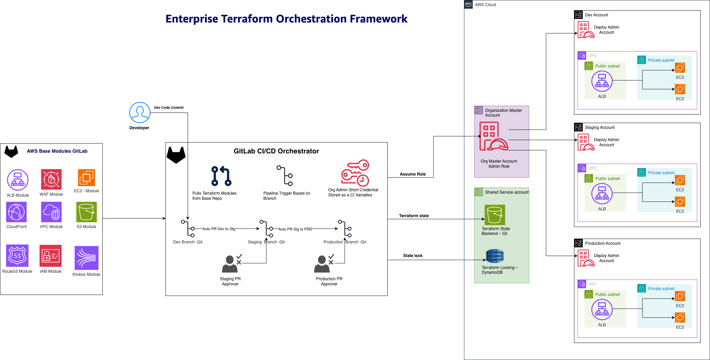

# Terraform Orchestration Framework

[](https://gitlab.com/your-org/terraform-orchestration-framework/-/pipelines)
[](https://www.terraform.io/)
[](https://registry.terraform.io/providers/hashicorp/aws/latest)

A practical Terraform orchestration framework that helps platform teams manage infrastructure across multiple AWS accounts. We built this to solve the common problem of deploying the same infrastructure patterns safely across dev, staging, and production environments.

## What This Solves

If you're a platform engineering team managing infrastructure for multiple teams, you've probably faced these challenges:
- Teams want to deploy the same infrastructure patterns (VPC, RDS, Lambda) but with different configurations
- You need a safe way to promote changes from dev to production
- Managing Terraform state across multiple AWS accounts is painful
- You want teams to self-serve but within guardrails

This framework addresses all of these. We use it internally and it's part of the [AWS Architecture Pattern Guide](https://apg-library.amazonaws.com/content-viewer/4cf1a61e-2f34-459c-98f1-b5400c918a8e).

## How It Works

The framework uses a simple concept: you create "base modules" for your infrastructure patterns (like VPC, RDS, Lambda), and teams specify what they want in configuration files. The orchestrator handles the deployment across environments.

Here's what makes it useful:
- Works with any AWS service - we include ALB/EC2 as examples, but you can use it for anything
- Automatic promotion from dev → staging → production with GitLab merge requests
- Cross-account deployments using AWS Organizations roles
- Centralized state management so you don't lose track of resources
- Teams can't accidentally deploy to production (manual approvals required)

## Architecture



We use a multi-account setup:
- **Organization account**: Where GitLab runs and assumes roles into other accounts
- **Shared services account**: Stores Terraform state and handles locking
- **Environment accounts**: Separate AWS accounts for dev, staging, production


The GitLab workflow is straightforward:
- Developers push to `dev` branch → automatic deployment to dev environment
- Success creates a merge request to `staging` → manual approval required
- Staging success creates merge request to `production` → manual approval required

## Getting Started

### What You Need

Before starting, make sure you have:
1. AWS Organization set up with cross-account roles
2. GitLab with CI/CD runners
3. Terraform 1.6 or newer
4. Basic familiarity with Terraform modules

### Important: Replace the Placeholder Values

The repository contains placeholder AWS account IDs that you MUST replace before deploying. If you don't, deployments will fail with authentication errors.

Edit these files with your real account IDs:
- `config/aws-accounts.json`
- `tfvars/dev-terraform.tfvars`
- `tfvars/stg-terraform.tfvars` 
- `tfvars/prod-terraform.tfvars`

Look for values like `SHARED_SERVICES_ACCOUNT_ID` and replace them with your actual account numbers.

### Quick Setup

1. Clone the repository:
```bash
git clone https://gitlab.com/{YOUR_ORG}/terraform-orchestrator.git
cd terraform-orchestrator
```

2. Copy the example configuration files:
```bash
cp config/aws-accounts.json.example config/aws-accounts.json
cp tfvars/dev-terraform.tfvars.example tfvars/dev-terraform.tfvars
# ... repeat for staging and production
```

3. Edit the configuration files with your AWS account IDs and settings.

4. Set up GitLab CI/CD variables in your project settings:
- `AWS_ACCESS_KEY_ID` and `AWS_SECRET_ACCESS_KEY` (from your organization account)
- `GITLAB_API_TOKEN` (for creating merge requests)
- `TERRAFORM_STATE_BUCKET` and `TERRAFORM_LOCKS_TABLE` (in your shared services account)

5. Test it out:
```bash
git checkout dev
# Make some changes to tfvars/dev-terraform.tfvars
git add .
git commit -m "test: trying out the orchestrator"
git push origin dev
```

Watch the GitLab pipeline run. If everything works, you'll see your infrastructure deployed to the dev environment.

## Using It for Your Infrastructure

The examples in this repo use ALB and EC2, but that's just for demonstration. Here's how to adapt it for your needs:

### Example: Adding RDS Support

1. Create or use an existing RDS base module in your GitLab
2. Add it to your `base_modules` configuration:
```hcl
base_modules = {
  rds = {
    repository = "your-rds-base-module"
    version    = "v1.0.0"
  }
}
```

3. Define what you want in your tfvars:
```hcl
rds_spec = {
  main-database = {
    engine         = "postgres"
    instance_class = "db.t3.micro"
    vpc_name      = "main-vpc"
  }
}
```

The orchestrator will handle downloading the module and deploying it with your configuration.

## How Deployments Work

### Development Environment
When you push to the `dev` branch, the pipeline automatically:
- Validates your Terraform configuration
- Plans the infrastructure changes
- Deploys to your dev AWS account
- Creates a merge request to staging (if successful)

### Staging Environment
When you merge the dev → staging MR:
- Pipeline runs terraform plan for staging
- Waits for manual approval (click a button in GitLab)
- Deploys to staging account
- Creates a merge request to production (if successful)

### Production Environment
Same process as staging, but with extra scrutiny since it's production.

## Destroying Infrastructure

Sometimes you need to tear things down. We made this safe by requiring manual approval:

1. Go to GitLab CI/CD → Pipelines
2. Click "Run Pipeline"
3. Add a variable: `DESTROY_ENVIRONMENT` = `dev` (or staging/production)
4. Run the pipeline and approve the destroy job when prompted

## Configuration Examples

Here's how you might configure different AWS services:

```hcl
# VPC Module
vpc_spec = {
  main-vpc = {
    cidr_block = "10.0.0.0/16"
    availability_zones = ["us-east-1a", "us-east-1b"]
  }
}

# Lambda Function
lambda_spec = {
  api-handler = {
    runtime = "python3.9"
    handler = "index.handler"
    source_path = "src/lambda"
  }
}

# RDS Database
rds_spec = {
  main-db = {
    engine = "postgres"
    instance_class = "db.t3.micro"
    allocated_storage = 20
  }
}
```

## Security Considerations

We designed this with security in mind:
- Cross-account role assumption (no long-lived credentials in target accounts)
- Encrypted Terraform state in S3
- State locking with DynamoDB to prevent concurrent modifications
- Manual approvals required for staging and production
- Audit trail through GitLab CI/CD logs

Make sure to:
- Set up branch protection rules in GitLab
- Use least-privilege IAM roles
- Enable CloudTrail in all accounts
- Rotate access keys regularly

## Troubleshooting

### Common Issues

**"Module download fails"**: Check that your `GITLAB_API_TOKEN` has access to your base module repositories.

**"Backend access denied"**: Verify that the cross-account roles exist and trust relationships are correct.

**"State lock timeout"**: Usually means someone else is running Terraform. Wait a few minutes or check if a pipeline is stuck.

**"Resource conflicts"**: Review the order of your module dependencies. Some resources need to be created before others.

### Getting Help

Check the diagnostic scripts in the `scripts/` directory. They can help identify common configuration issues.

If you're still stuck, the GitLab CI/CD logs usually contain helpful error messages.

## Contributing

We welcome contributions! A few guidelines:
- Always work in the `dev` branch first
- Test your changes thoroughly in dev before creating merge requests
- Keep changes small and focused
- Use clear commit messages (we like the conventional commit format)

## What's Next

This framework is actively maintained and used in production environments. We're always looking for ways to improve it based on real-world usage.

Some ideas we're considering:
- Support for more complex deployment patterns
- Integration with AWS Config for compliance checking
- Better error handling and rollback capabilities

If you have suggestions or run into issues, please open an issue in GitLab.

---

*This framework is part of the AWS Architecture Pattern Guide and represents patterns we've seen work well in enterprise environments. It's not the only way to do infrastructure orchestration, but it's a solid starting point that scales well.*